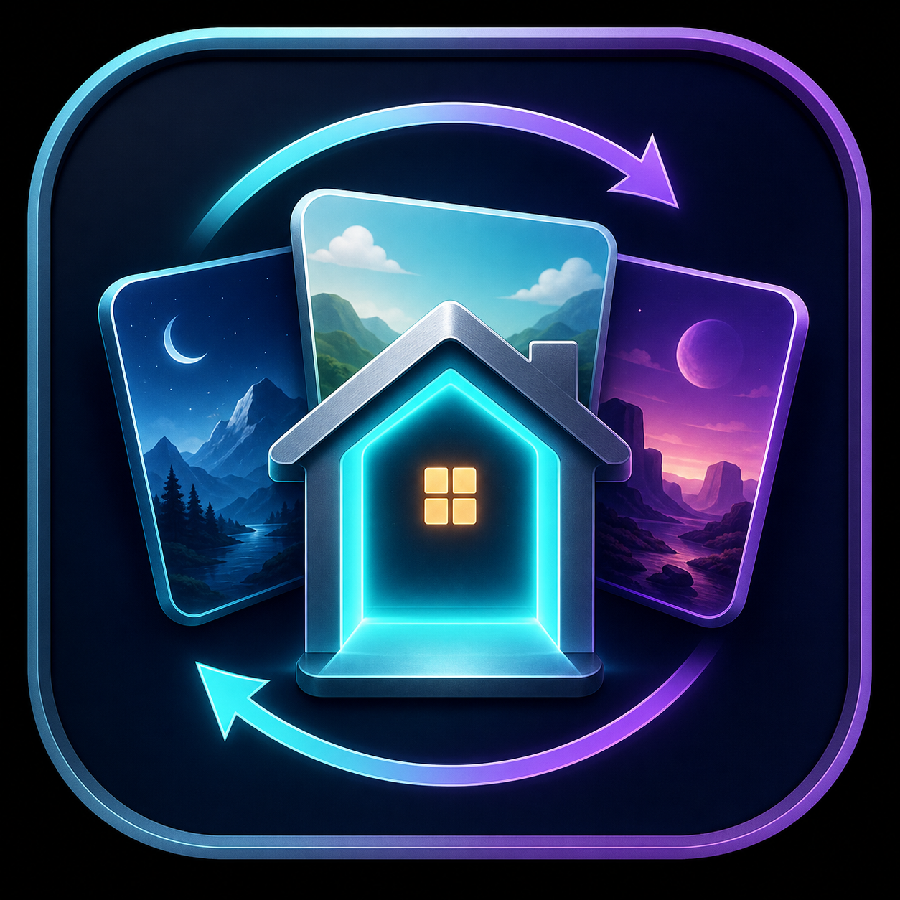

<p align="center">
  
</p>

<h1 align="center">Quest Home Switcher</h1>

<p align="center">
  A Quest-native Home library and switcher with Root and Shizuku support, plus a guided Windows setup.
</p>

<p align="center">
  <a href="https://github.com/nikitat21/Quest-Home-Switcher/releases/latest">Download</a> ·
  <a href="docs/INSTALLATION.md">Installation</a> ·
  <a href="docs/TROUBLESHOOTING.md">Troubleshooting</a> ·
  <a href="android-app/CHANGELOG.md">Changelog</a>
</p>

> **Unofficial community project.** Quest Home Switcher is not affiliated with or endorsed by Meta, Shizuku, or Quest Home Porter.

## Download

Use the files from the [latest GitHub Release](https://github.com/nikitat21/Quest-Home-Switcher/releases/latest). Do not download APKs or EXEs from the source tree.

| File | Choose this when |
| --- | --- |
| `Quest-Home-Switcher-Setup-v1.1.exe` | You want the recommended guided Windows installation, Shizuku setup, verified updates, and optional Home import. |
| `Quest-Home-Switcher-v1.1.apk` | You already know how to sideload an APK, or you use a rooted Quest without Shizuku. |

See [the v1.1 release notes](docs/RELEASE_v1.1.md) for the current fixes and known limitations.

## Quick start

1. Enable Meta Developer Mode for the headset and connect the Quest to a Windows PC over USB.
2. Put on the headset and approve the USB debugging prompt. Enable **Always allow from this computer** when it is your own PC.
3. Run `Quest-Home-Switcher-Setup-v1.1.exe` and select **SET UP / REPAIR**.
4. Follow the headset instructions. If Shizuku is already running, setup leaves it untouched and goes directly to installing or updating Quest Home Switcher.
5. Place compatible Home APKs in `Download/Quest Homes`, or use **IMPORT HOME APKS** in setup.
6. Open Quest Home Switcher, approve its Shizuku permission once when asked, select a Home, and choose **Apply Home**.

First-time Shizuku pairing is explained step by step in [Installation](docs/INSTALLATION.md). Rooted users can use the APK directly without Shizuku.

## Import Home APKs

The Windows setup provides the easiest way to add Homes:

1. Connect and authorize the Quest over USB.
2. Open the setup and select **IMPORT HOME APKS**.
3. The file picker opens the detected Quest Home Editor `Cooked` folder when available. Otherwise it uses the last location or your Downloads folder.
4. Select one or more compatible **NoRoot-Spoof Home APKs**.
5. Review the detected names. Each row has a permanently highlighted **Name on Quest** field that you can edit directly.
6. Select **CONTINUE TO IMPORT**. Missing `.apk` endings and unsafe filename characters are cleaned automatically without asking you to continue a second time. Only duplicate names need manual correction.
7. Check the clear result window, select **DONE**, then open Quest Home Switcher in the headset and select **Refresh**.

The setup validates every selected APK and copies accepted Homes to `Download/Quest Homes` on the headset. It does not include or download Home APKs for you.

## Features

- Quest-friendly two-pane Home library with search, refresh, active-Home status, and clear actions.
- Automatic Root, Shizuku server, and Shizuku permission state detection.
- Direct switching through `oculuspreferences` on rooted devices.
- Rootless switching through a locally running Shizuku service.
- Recursive scanning of `Download`, `Quest Homes`, `QuestHomes`, and `Homes`.
- Strict Home validation: an APK must contain `assets/scene.zip`.
- Official Home name lookup from scene content, not only from filenames.
- Metadata caching and scene-based duplicate grouping for faster refreshes.
- Pre-install validation, post-install verification, and automatic rollback on failure.
- Horizon Home reload after a successful switch; a full headset reboot is normally unnecessary.
- One-tap access to Meta's built-in **Debug Settings** when Root or Shizuku is ready; the Switcher never changes a debug preference automatically.
- Guided Windows setup that preserves an already-running Shizuku server.
- Optional multi-file Home importer with readable names, collision handling, and upload verification.

## Root or Shizuku?

| Mode | Best for | How it works | Home source |
| --- | --- | --- | --- |
| **Root** | A Quest with working Magisk/`su` | Reads and writes the active environment preference directly, then reloads VR Shell. Shizuku is not required. | Installed environment packages |
| **Shizuku** | A normal, unrooted Quest | Uses the local Shizuku shell service to validate and temporarily replace the compatible environment package, with verification and rollback. | Compatible NoRoot-Spoof Home APKs stored on the headset |

The app selects Root mode automatically when verified root access is available. Otherwise it guides the user toward Shizuku.

## Requirements

- Meta Quest 2, Quest 3, or Quest Pro.
- Meta Developer Mode and USB debugging for installation.
- Windows 10 or 11 for the guided setup.
- Either working Magisk/`su` root access, or Shizuku running through Wireless debugging.
- User-provided compatible Quest Home APKs. This project does not include Home APKs or Meta assets.

## Safety and rollback

Horizon OS does not provide a public Home-switching API, so every switch must use privileged local operations.

- The app validates the selected APK again immediately before activation.
- Rootless activation keeps a temporary rollback copy, verifies the installed scene, and restores the previous Home when possible if activation fails.
- Setup does not stop, downgrade, re-pair, update, or reinstall a Shizuku server that is already verified as running.
- If Android reports a signing-key mismatch for the current Switcher package, setup asks for explicit approval before removing only that conflicting installation and retrying the verified release.
- The importer never trusts a filename alone and never silently overwrites a different remote file.
- Signing keys, passwords, Home APKs, and Meta content are not stored in this repository.

Read [Troubleshooting](docs/TROUBLESHOOTING.md) before retrying a failed activation repeatedly.

## Known limitations

- Shizuku must be started again after a full headset reboot. On some Horizon OS versions, Wireless debugging must be toggled off and on once before Android discovers the service.
- Android intentionally requires the user to approve USB debugging, the one-time pairing code, and the Switcher's Shizuku permission.
- Rootless mode needs compatible NoRoot-Spoof Home APKs. A normal Android APK is rejected even if its filename looks like a Home.
- Firmware, root frameworks, and third-party Home packages vary. Root behavior and Home compatibility cannot be guaranteed on every Horizon OS build.
- Meta Debug Settings is an internal, build-dependent panel. The launcher can stop working after a Horizon OS update, and visible controls are not a promise that Meta's remote/account-gated feature is usable.
- A third-party APK can contain unsafe code. Only use files from sources you trust.

## Build from source

The repository has two independent components:

```text
android-app/       Quest-native Kotlin/Jetpack Compose application
windows-setup/     PowerShell/WPF setup with a small C# one-file launcher
docs/              Installation, troubleshooting, and release documentation
```

Build and validate the Android app with Java 17:

```powershell
cd android-app
.\gradlew.bat :app:testDebugUnitTest :app:lintDebug :app:assembleDebug
```

Build the Windows setup on Windows:

```powershell
cd windows-setup
powershell -NoProfile -ExecutionPolicy Bypass -File .\Build.ps1
```

See [android-app/README.md](android-app/README.md) and [windows-setup/README.md](windows-setup/README.md) for component details. Release signing material must remain offline and must never be committed.

## Privacy

The Quest app has no analytics, advertising, accounts, or network communication of its own. It reads local APK files and communicates only with local Root or Shizuku services.

The Windows setup contacts the official Google Platform Tools download and the official `RikkaApps/Shizuku` GitHub release source only when those components are required. It does not upload the user's Home APKs or headset data.

## Credits

- [xAstroBoy/QuestEnvironmentPicker](https://github.com/xAstroBoy/QuestEnvironmentPicker) for the original environment-picker work and technical reference.
- [xAstroBoy/Quest-Home-Editor](https://github.com/xAstroBoy/Quest-Home-Editor) for Quest Home research and community tooling.
- [RikkaApps/Shizuku](https://github.com/RikkaApps/Shizuku) for the local privileged-service bridge used by rootless mode.
- The Quest Home community for testing and compatibility research.

All Meta names and assets remain the property of their respective owners. No Meta Home APKs or proprietary Home content are included.

## License

This repository does not currently grant an open-source license. See [LICENSE.md](LICENSE.md).
