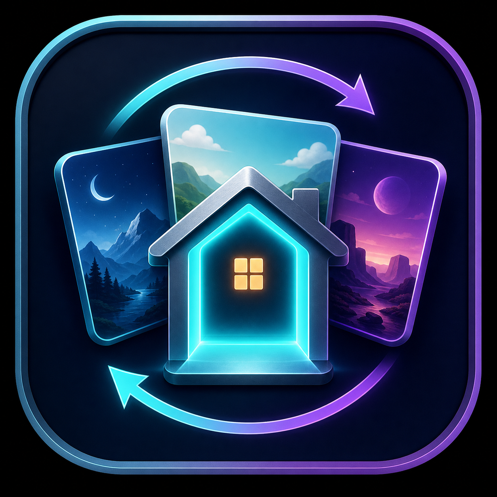

  

<h1 align="center">Quest Home Switcher · v2</h1>

  <strong>A different place to call Home.</strong> 
  Discover, download and switch Quest Homes. All from one clear, familiar panel.

  <a href="docs/DOWNLOAD.md"><strong>Get v2</strong></a> &nbsp;·&nbsp;
  <a href="docs/INSTALLATION.md">Installation</a> &nbsp;·&nbsp;
  <a href="docs/RELEASE_v2.md">What’s new</a> &nbsp;·&nbsp;
  <a href="docs/TROUBLESHOOTING.md">Help</a>

Need help? Ping <code>@Nikita</code> on Discord — FreeXR or QuestHomes.

v2 is here · Your next Home is closer.

> [!IMPORTANT]
> **Installing from a PC? Include `-g`.** It enables the automatic ADB setup path on supported Quest firmware.
>
> `adb install -g Quest-Home-Switcher-v2.apk`
>
> [PC installation, step by step →](docs/INSTALLATION.md#install-from-a-pc-recommended) · [Installing directly on Quest instead? →](docs/INSTALLATION.md#install-directly-on-quest)

  <strong>A special thank-you to <a href="https://github.com/Lumince">Lumi</a></strong> 
  For her Root improvements, hands-on testing and thoughtful feedback throughout v2. 
  <a href="https://github.com/Lumince">Meet Lumi</a> &nbsp;·&nbsp;
  <a href="https://github.com/Lumince?tab=repositories">Explore her projects</a>

---

## Your Homes. One place.

**Rediscover the classics.** Browse 22 original Meta Homes with their own artwork and descriptions.

**Find something different.** Search and sort the Community catalog, or bring your own compatible NoRoot Home APKs. Personalize names and pictures.

**Keep your favorites close.** See what is installed and active. Apply a Home, download an update or remove an unused Custom Home — all in one panel.

Built-in Wireless ADB means **no Shizuku setup**. Working Root is detected automatically, with the matching Home variants. App and Home updates are independent, with integrity checks before installation.

[See what changed in v2 →](docs/RELEASE_v2.md)

## Start with the route that suits you

| Your setup | What to do |
| --- | --- |
| **PC + Quest** · recommended | Install with **`adb install -g`**, then open the app. Automatic setup is attempted; manual instructions appear if needed. |
| **Download directly on Quest** | Install the APK, then complete one manual Wireless ADB pairing. After connecting, QHS tries to enable automatic setup for next time. |
| **Already rooted** | Open QHS with working `su` access. Root verification selects the Root path; Wireless ADB pairing is not needed while Root is ready. |

**New to sideloading?** [The installation guide](docs/INSTALLATION.md) covers the download, USB authorization, the exact command and what you will see next. No separate desktop setup tool is required.

**Already using an older Switcher?** [Read the short migration guide](docs/MIGRATING-TO-V2.md) before removing anything.

## Your files stay yours

After setup, find your NoRoot downloads and personal APKs in **Downloads → Quest Home Switcher → Official Homes / Custom Homes**. Existing folders are reused on updates. Root uses installed environment packages and its own download folder.

[Adding Homes, folders and updates →](docs/HOMES.md)

## Before you begin

QHS is an **unofficial community project**, not a Meta product. It changes the Quest Home through privileged local operations. Use compatible files you trust and keep a known-good Home available.

Made for **Quest 3 / 3S** on compatible Horizon OS firmware; hands-on validation so far is primarily Quest 3. Root and firmware compatibility vary. [Compatibility and limits →](docs/COMPATIBILITY.md)

**One app. Two Libraries. No GitHub sign-in.** Download the app, complete setup and choose your Homes. [Get v2 →](docs/DOWNLOAD.md)

## Need a hand?

[Setup help](docs/TROUBLESHOOTING.md) · [Privacy & permissions](docs/PRIVACY.md) · [Support logs](docs/RELEASE-SUPPORT-LOGS.md) · [Report a problem](docs/SUPPORT.md)

For contributors & curious people

QHS is a native Kotlin / Jetpack Compose Android panel app, with a small native ADB transport. See [development](docs/DEVELOPMENT.md), [contributing](CONTRIBUTING.md) and [security](SECURITY.md).

Thanks also to [AstroBoy](https://github.com/xAstroBoy) for Quest Home research and editor tooling, the Home creators, and everyone testing and reporting issues. Shizuku powered the legacy app; v2 uses its own local ADB connection.

Meta and third-party names, artwork and Homes belong to their respective owners. Home packages are separate Library assets, not bundled into the Switcher APK. Source access does not grant an open-source license: see [LICENSE.md](LICENSE.md).

[Older versions archive](docs/ARCHIVE.md)

